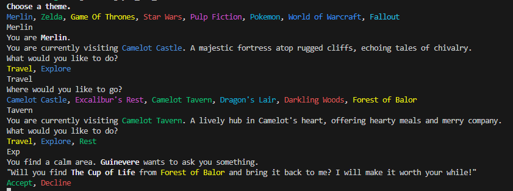

# You are Merlin

A text adventure game, built with Rust. Compiles to CLI and WASM.

[Click here for the WebAssembly (WASM) version with a web demo](https://github.com/hseager/you-are-merlin-www)

## Game Features

- Main quest with a final world boss, try to beat them!
- Different Themes
- Side quests
- Items
- Battles
- Recovery

### Tips

- Finding a safezone will make your journey easier!
- Try exploring and get stronger before facing the final boss
- You don't have to type out the full action, a partial match will do

## To do

#### v1.0
- Boss quote
- chatGPT API
- Chance for Run to fail
- Usable items
- Better item stats (crit chance/multi/ lifegain on hit)
- Rewards (gold) and trade
- Mini bosses for dungeons
- Dungeon difficulty, more battles = better reward
- More types of encounters like puzzles and riddles etc
    - Choice encounter with reward or damage
- Split items into types like weapons, armor, utilities with unique stats

#### later
- Require key for main boss
- Better visuals for life/attack

### Refactor

- Stop cloning everything... try to reference locations etc
- Unit tests

## Dev

- cargo build
- cargo run
